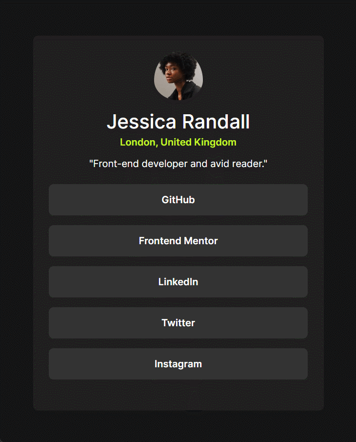

<h1 align="center"> Desafios - Frontend Mentor</h1>

   

Este repositório foi criado para armazenar minhas soluções para os desafios do site <a href="https://www.frontendmentor.io">Frontend Mentor</a>. O Frontend Mentor oferece uma variedade de desafios práticos para aprimorar suas habilidades em HTML, CSS, JavaScript e API. Os desafios são categorizados por nível de dificuldade (Newbie, Junior, Intermediate, Advanced e Guru), tornando-os ideais para desenvolvedores de todos os níveis de experiência.

<h2>✅ Desafio 1 - Página de receita</h2>

    

        
        
    

 

- <strong>Link do desafio:</strong> <a href="https://www.frontendmentor.io/challenges/recipe-page-KiTsR8QQKm">Clique aqui.</a>
- <strong>Link do deploy:</strong> <a href="https://k1-recipepagemain.vercel.app">Clique aqui.</a>
- <strong>Link do repositório:</strong> <a href="https://github.com/kauanguilhermesantos/desafios-frontend-mentor/tree/main/pagina-de-receita">Clique aqui.</a>

<h2>✅ Desafio 2 - Página de links de redes sociais</h2>

    

        
        
    

 

- <strong>Link do desafio:</strong> <a href="https://www.frontendmentor.io/challenges/social-links-profile-UG32l9m6dQ">Clique aqui.</a>
- <strong>Link do deploy:</strong> <a href="https://k1-social-links-profile-main.vercel.app">Clique aqui.</a>
- <strong>Link do repositório:</strong> <a href="https://github.com/kauanguilhermesantos/desafios-frontend-mentor/tree/main/pagina-de-links-de-redes-sociais">Clique aqui.</a>

<h2>🔄 Desafio 3 - Blog preview card</h2>

- <strong>Link do desafio:</strong> <a href="https://www.frontendmentor.io/challenges/blog-preview-card-ckPaj01IcS">Clique aqui.</a>

<h2>😉 Me siga</h2>

    
    
🚀<strong>Kauan Guilherme Santos</strong>🚀

    <a href="https://www.linkedin.com/in/kauan-guilherme-santos" target="_blank">
    

