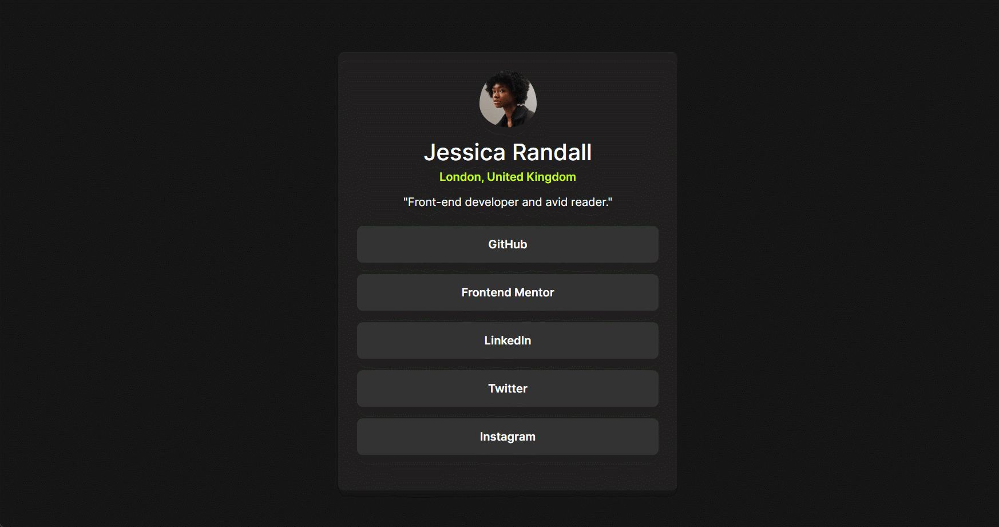

<h1 align="center"> Desafio 2 - Link tree</h1>

   

    

        
        
    

<h2>💻 Sobre o projeto</h2>
    
O desafio proposto tem o objetivo de treinar as habilidades em <strong>HTML</strong> e <strong>CSS</strong>, por meio da criação da página de redes sociais de um perfil.

    
Assim, foram utilizados conceitos de <strong>Flexbox</strong>, <strong>tags semânticas</strong> em HTML, <strong>estrutura básica</strong> de um página, <strong>importação de fonte</strong>, <strong>responsividade</strong> e <strong>variáveis</strong> em CSS.

    <ul>
        <li>Para acessar o link do desafio do Frontend Mentor, <a href="https://www.frontendmentor.io/challenges/social-links-profile-UG32l9m6dQ" target="_blank">clique aqui.</a></li>
    </ul>
<h2>👀 Deploy do projeto</h2>
    <ul>
        <li>Para ver a página funcionando, <a href="#" target="_blank">clique aqui</a>.</li>
    </ul>

<h2>🛠️ Ferramentas utilizadas</h2>
    <ul>
        <li>Tecnonogias: HTML e CSS</li>
        <li>Utilitário: <a href="https://vercel.com
        " target="_blank">Vercel</a></li>
    </ul>

<h2>😉 Me siga</h2>

    
    
🚀Kauan Guilherme Santos🚀

    <a href="https://www.linkedin.com/in/kauan-guilherme-santos" target="_blank">
    

